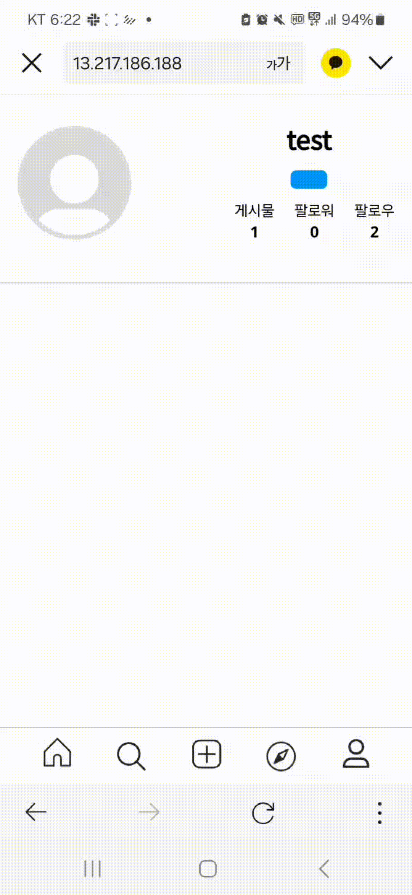
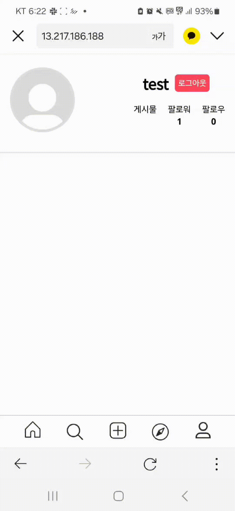

# 인스타그램 클론코딩 프론트 README

- 배포 URL : http://13.217.186.188/
- Test ID : test
- Test PW : 1234
- 개발기간⏰ 25.02-25.03

<br>

## 프론트 팀원 구성

- 김남빈 <a href="https://github.com/orgs/instagram-clonecoding-4/people/kimnambin"> </a>

  - UI : 메인 화면 , 업로드 페이지 , 게시글 , 로그인/회원가입
  - 기능 : 로그인 / 회원가입 , 게시글 업로드 , 게시글 좋아요 , 팔로우/팔로잉
  - 공통 컴포넌트 : 로그인한 사용자 정보 유지

- 이승우 <a href="https://github.com/leeseungwooo"> </a>

<br>

## 1. 개발 환경


- 자바스크립트의 기초를 이해하고 학습하기 위해 바닐라 자바스크립트를 사용하였습니다.
- 비교적 간단한 프로젝트이기에 외부 라이브러리나 프레임워크를 사용하지 않고 프로젝트를 개발했습니다.

<br>

## 2. 브랜치 전략

- main : 배포 시 사용
- feature/ : 기능 구현시 사용
- test / : 테스트 시 사용

<br>

## 3. 프로젝트 구조

```
📦js
┣ 📂component
┃ ┗ 📜get-user-id.js
┣ 📂post-upload
┃ ┣ 📜post-photo.js
┃ ┣ 📜post-put.js
┃ ┗ 📜post-write.js
┣ 📂posting
┃ ┣ 📜comment-list.js
┃ ┣ 📜detail-profile.js
┃ ┣ 📜likes-list.js
┃ ┣ 📜main-page.js
┃ ┣ 📜Mypage.js
┃ ┗ 📜posting-list.js
┣ 📂users
┃ ┣ 📜joinup.js
┃ ┣ 📜login.js
┃ ┗ 📜password-reset.js
┗ 📜index.js
┃
┃
📦pages
┣ 📂post-upload-page
┃ ┣ 📜photo.html
┃ ┣ 📜post-put.html
┃ ┗ 📜write.html
┣ 📜detail-profile.html
┣ 📜join-page.html
┣ 📜login.html
┣ 📜main-page.html
┣ 📜Mypage.html
┣ 📜password-reset.html
┃ 📜postdetail.html
┃
┣ 📜photo.html
┣ 📜post-put.html
┗ 📜write.html
```

<br>

## 4. 화면

[게시글 업로드]

- 파일 업로드 : FileReader API를 사용해서 한번에 여러 파일을 업로드 할 수 있도록 하였습니다.
- 이미지 슬라이드 : 여러 파일을 업로드하면 이미지 슬라이드와 페이지네이션을 통해 사용자가 슬라이드 형태로 볼 수 있게 하였습니다.
- 서버와 통신 : FormData를 사용하여 파일과 사용자가 작성한 텍스트를 서버로 전송하도록 했습니다.

| 게시글-업로드                         |
| ------------------------------------- |
|  |

<br>

[팔로우,팔로잉]

- 팔로우 상태 UI : 팔로우하고 있는 사용자는 언팔로우 버튼이 회색으로 표시되고, 팔로우하고 있지 않은 경우에는 팔로우 버튼이 푸른색으로 나타나도록 하였습니다.
- 비동기 업데이트 : 비동기 처리를 통해 화면을 리로딩하지 않아도 즉각적으로 팔로우 및 언팔로우 상태가 업데이트 되도록 하였습니다.

| 팔로우,팔로잉                          |
| -------------------------------------- |
|  |

<br>

[마이페이지]

- 마이페이지 구분: URL 파라미터에 사용자 ID를 추가하여 현재 페이지가 나의 마이페이지인지 다른 사용자의 마이페이지인지를 구별할 수 있도록 하였습니다.
- 게시글 상세 정보 : 업로드한 게시글을 클릭하면 게시글의 상세 정보를 모달 창을 통해 확인할 수 있도록 구현하였습니다.

| 마이페이지                          |
| ----------------------------------- |
|  |

<br>

[로그인]

| 로그인                          |
| ------------------------------- |
|  |

<br>

## 5. 트러블 슈팅

<details>
<summary>
  API 통합 테스트 오류
</summary>

## 해결 방법

- 오류 메시지 확인

  - 오류가 날때마다 로그를 확인하며 어떤 오류 인지 확인했습니다.

- API 명세서 확인

  - 잘못된 형식으로 요청한 건지 API 명세서를 확인했습니다.

- 백엔드 팀원과 지속적 소통
  - Slack, GitHub 등을 통해 지속적으로 소통하면서 문제점을 파악할 수 있었습니다.
    이 과정에서 API 명세서와 코드 간의 불일치하는 부분을 발견할 수 있었습니다.

</details>

<br>

<details>
<summary>
  팀원간 실력 격차
</summary>

## 해결 방법

- 역할분담

  - 페이지 구현부터 기능 구현까지 팀원의 역할을 분담하여 효율적인 개발이 이루어질 수 있도록 노력했습니다.

- 코드 리뷰

  - 구현이 끝난 후나 오류가 발생할 때마다 함께 코드를 살펴보며 잘 작동되는 지 확인하고 오류는 왜 발생하는 지 분석했습니다.

  </details>
